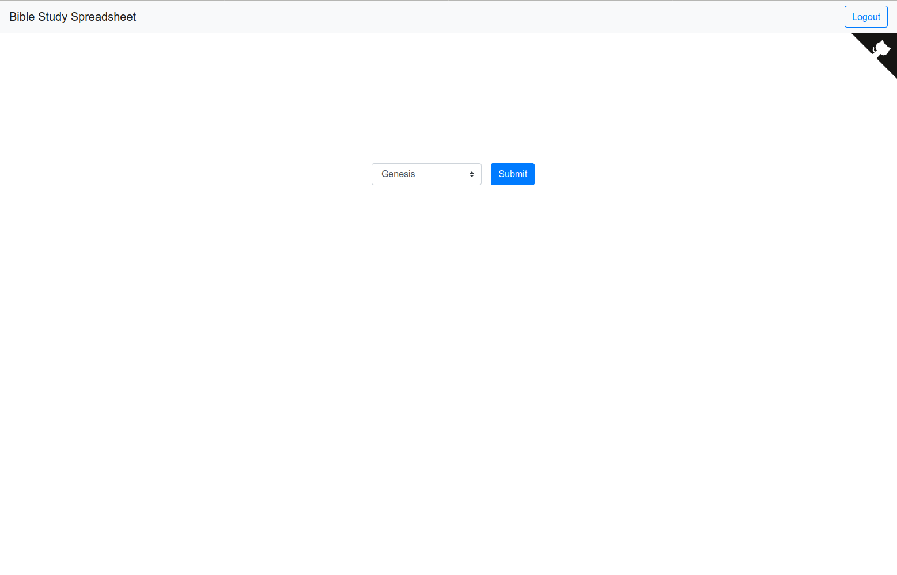
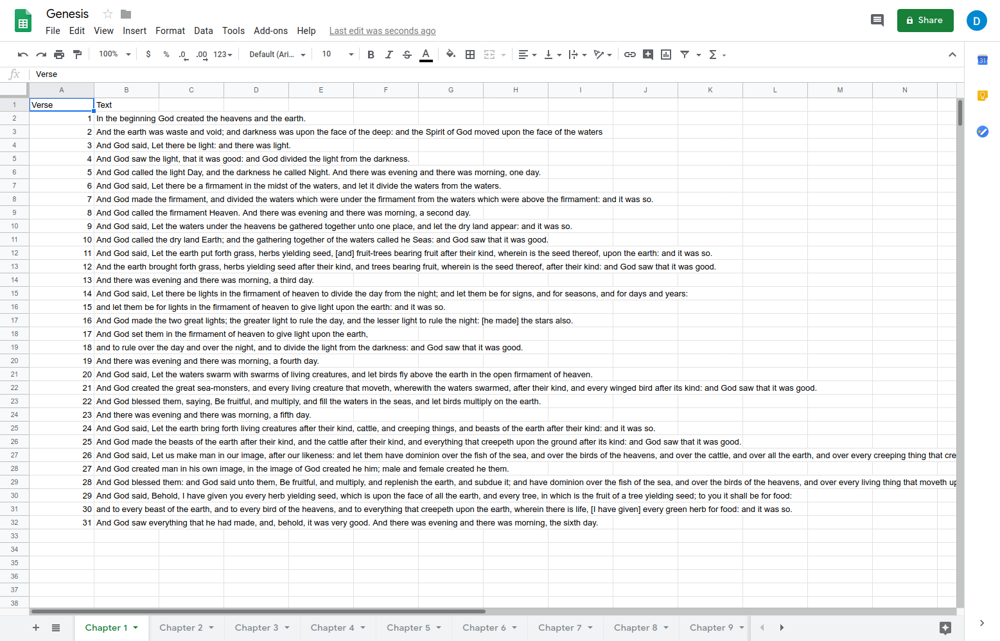

# Bible Study Spreadsheet
Wrote this as a favor for a friend.

## Instructions
  * Download one of the JSON Bibles from [bibleapi-bibles-json](https://github.com/bibleapi/bibleapi-bibles-json).
  * Install dependencies with `mix deps.get`
  * Create and migrate your database with `mix ecto.setup`
  * Install Node.js dependencies with `cd assets && npm install`
  * Start Phoenix endpoint with `mix phx.server`

Now you can visit [`localhost:4000`](http://localhost:4000) from your browser.

God bless!
